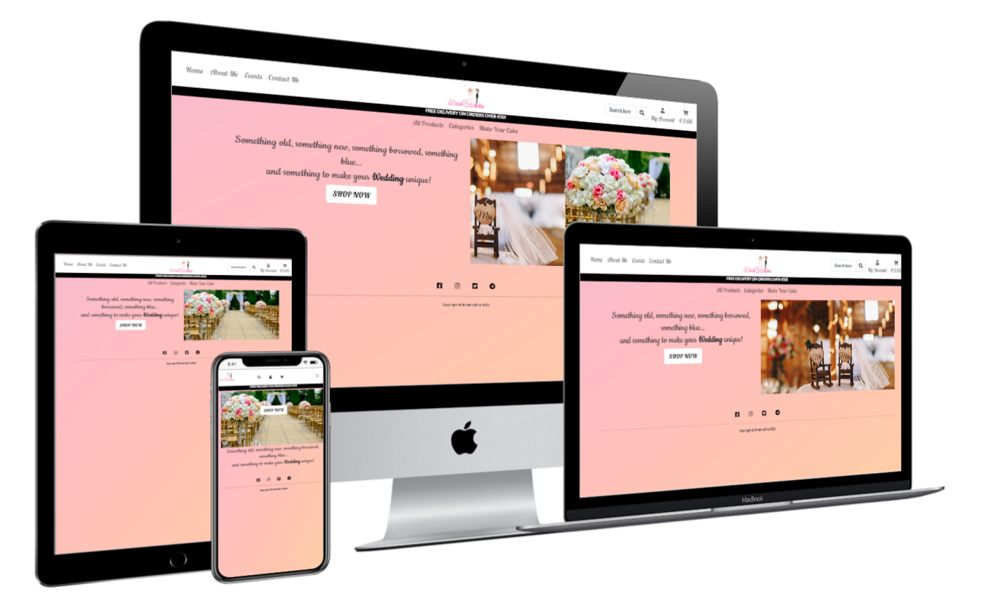

 


**Code Institute - Milestone Project 4**

[View webpage in GitHub Pages](https://github.com/maxthor500/BrideNoZilla)



This project is the last Milestone Project that make up the Full Stack Developer course at the Code Institute.

This project aims to build a full-stack web application using the python framework Django, Relational database (recommending MySQL or Postgres) and Stripe payments.

**BRIDE NO ZILLA** is a e-commerce where you can find products to use in a wedding.

This website is for educational purposes and the stripe functionality is set up to accept the test card details please don't enter your personal card details. 

- To use the stripe function use the following details.

  - card number : 4242 4242 4242 4242
  - Any date
  - Any CVV number.

[Click here to see the website live](https://bride-no-zilla.herokuapp.com/)

## User Experience

### User Stories

| As A/AN     | I WANT TO BE  ABLE TO…                                       | SO THAT I CAN…                                               |
| ----------- | :----------------------------------------------------------- | ------------------------------------------------------------ |
| Shopper     | View  a list of products                                     | Select  some to purchase                                     |
| Shopper     | View  individual product details                             | Identify  the price, description, product rating, product image and available sizes. |
| Shopper     | Easily  view the total of my purchase at any time            | Avoid  Spending too much                                     |
| Site User   | Easily  register for an account                              | Have  a personal account and be able to view my profile      |
| Site User   | I am looking for a responsive web design                     | I can display content of website adequately to the device    |
| Site User   | Easily  login or logout                                      | Access  my personal account information                      |
| Site User   | Easily  Recover my password in case I forget it              | Recover  access to my account                                |
| Site User   | Receive  an email confirmation after registering             | Verify  that my account registration was successful          |
| Site User   | Have  a personalized user profile                            | View  my personal order history and order confirmations, and save my payment  information |
| Shopper     | Sort  the list of available products                         | Easily  identify the best-rated, best-priced and categorally sorted products |
| Shopper     | Sort  a specific category of product                         | Find  the best-priced or best-rated product in a specific category or sort the  products in that category by name |
| Shopper     | Sort  multiple categories of products simultaneously         | Find  the best-priced or best-rated product across broad categories, such  as"clothing" or "homeware" |
| Shopper     | Search  for a product by name or description                 | Find  a specific product I'd like to purchase                |
| Shopper     | Easily  see what I've searched for and the number of results | Quickly  decide whether the product I want is available      |
| Shopper     | Easily  select the size and quantity of a product when purchasing it | Ensure  I don’t accidentally select the wrong product, quantity or size |
| Shopper     | View  items in my bag to be purchased                        | Identify  the total cost of my purchase and all items I will receive |
| Shopper     | Adjust  the quantity of individual items in my bag           | Easily  make changes to my purchase before checkout          |
| Shopper     | Easily  enter my payment information                         | Check  out quickly and with no hassles                       |
| Shopper     | Feel  my personal and payment information is safe and secure | Confidently  provide the needed information to make a purchase |
| Shopper     | View  an order confirmation after checkout                   | Verify  that I haven't made any mistakes                     |
| Shopper     | Receive  an email confirmation after checking out            | Keep  the confirmation of what I've purchased for my records |
| Store Owner | Add  a product                                               | Add  new items to my store                                   |
| Store Owner | Edit/update  a product                                       | Change  product prices, descriptions, images and other product criteria |
| Store Owner | Delete  a product                                            | Remove  items that are no longer for sale                    |

### Strategy

My design goal is to make up everything the information as easy as possible making the UX simple and fun.

### Scope

The website is a place where the user can buy products to use in own wedding.

### Structure

I started developing my wireframes using Balsamiq for each page on mobile, tablet and laptop/desktop.

### Skeleton

*  [Wireframes](./readme_files/ms4-wireframe.pdf) PDF file.


### Surface

I next moved onto the design work of the website.

##### Colour Scheme

I used the following palette from [ColorSpace](https://mycolor.space/):


##### Typography

I used Google Fonts to select the fonts for my project.
The 'Lobster' font is the font used on the navbar and the headers, with cursive as the fall-back font in the case for any reason the font isn't being imported into the site correctly.

The 'Cookie' font is the font used on the homepage's main text, with cursive as the fall-back font in the case for any reason the font isn't being imported into the site correctly.

I used the 'Lato' font for every text in the body with sans-serif as the fall-back font, with the main font the reading seemed too thoughtful.

##### Imagery

I made the BNZ logo and I found the carousel images on [Unsplash](https://unsplash.com/).


### Database Models and Schema

  #### Database Models

   - Users

      - User

        - From Django Allauth containing the username, email, and password.

      - Userprofile

        - Model containing the user's details for future orders.

          

  - Products 
    
    - Products
    
      - Contains the product information for each product.
    
    - Categories
    
      - The categories for the products.
    
    - Inventory
    
      - the quantity available to buy.
    
      
    
- Checkout

     - Order
       - Contains details of the customer's orders, their details, and the items they've ordered.
     - Orderline item
       - Items for the customer order the quantity and total.


#### Database Schema

  - My database schema is shown in the following diagram.

    


## Features

#### Main feautures

#### Home page

- the main hero section shows a carousel of images , a sentence and the shop button. 
- the nav bar is clear, the section with info of the website and the  section about the user are divided from a central logo.


#### About Us page.

- The about us page gives the user information about the site.

  

  


#### Contact us page.

- The contact us page contains a heading and a contact form.

  

#### Registration.

- The registration page contains a form for users to sign up.

- Once the user fills the form and submits their details are stored in the database.

  

#### Login

- The login page contains a form for the user to login.
- Once the user enters the correct details they are logged in and redirected to home page that render the recent posts page.


#### Profile

- he user's profile page will hold the users shipping details for ease of shopping in future.

- It also has a reference to the users past orders.

  

#### Form

- Every forms are pretty similar as functionality.

- the forms have a header to indicate the purpose of the form.

- every inputs have a label or a placeholder to help the user.

- the submits flash a message for "successfully " or  "something wrong".

- add post  and edit post pages have a share button checked by default, if the post is not shared the user cans see it just on his profile page.

- the user add the comments from a page to render the posts with every comments already posted

- after the comment is posted the user cans just delete his post.

  the flash messages are rendered as span on the top of the page


#### 


### Features left to Implement

I had few time for this project, I would like:

* need to implement make cake app

## Technologies used

**Languages, libraries, frameworks, editors and version control**

* HTML5
  * The language used to create the form and add content to the website.
  
* CSS3
  * The language used to style the HTML5 elements.
  
* JavaScript
  * JavaScript was used throughout the website to make the site interactive.
  
* Python
  * Python was used to build the backend functionality of the web app.
  
* [Font Awesome](https://fontawesome.com)

* [Bootstrap 5](https://getbootstrap.com/docs/5.0/getting-started/introduction/) used for every the component of the website.

* [JQuery](https://jquery.com/)

* Visual Studio Code

* python virtualenv

* [Git Version Control](https://git-scm.com/)
  * I used Git for Version Control to record changes and updates to my files
  
* [GitHub](https://github.com/)
  * I used GitHub’s repository hosting service to host my deployed website as well as track previous versions of my code 
  
  

**Other tools used:**

* [Balsamiq](https://balsamiq.com/)
  * I used Balsamiq to create wireframes for my project for desktop, tablet and smartphone.
* [Google Images](https://www.google.com/images)
  * This was the source for the images in my project.
* [Google Fonts](https://fonts.google.com/)
* [dbdiagram.io](https://dbdiagram.io/home)
  - I used dbdiagram.io to make a diagram of my database schema.
* [W3Schools](https://www.w3schools.com/css/default.asp)
  - It was helpful with all my CSS doubts.
* [Techsini](http://techsini.com/multi-mockup/index.php)
  - Techsini was used to taking screenshots of the page at different screen sizes.
* [AutoPrefixer](https://autoprefixer.github.io/)
  - This project used **AutoPrefixer** to make sure the CSS code is valid for all browsers.
* [Typora](https://typora.io/)
* [Chrome DevTools](https://developers.google.com/web/tools/chrome-devtools)

*Note: I also found [Stack Overflow](https://stackoverflow.com/), [W3C Schools](https://www.w3schools.com/) and [MDN Web Docs](https://developer.mozilla.org/en-US/) helpful resources throughout the project, as well as the Code Institute Slack Community. 

- ### Django and Django extensions used

  - [Django](https://www.djangoproject.com/)
    - Django was used to create the project.

  - [Django Allauth](https://django-allauth.readthedocs.io/en/latest/)
    - Django allauth was used to create the user sign-in function for the site.

  - [Django Allauth Social Login](https://django-allauth.readthedocs.io/en/latest/providers.html/)
    - Django allauth Social login function was used to allow the user to sign up, or log in with Facebook.

  - [Django Countries](https://pypi.org/project/django-countries/)
    - Django Countries was used for the countries select field in the order form.

  - [Django Crispy Forms](https://django-crispy-forms.readthedocs.io/en/latest/)
    - Django Crispy Forms were used to utilise the bootstrap form classes.

  ### Frameworks Libraries and Programs.

  - [Stripe](https://stripe.com/ie)

    - CStripe has been used for the payment section of the site.

  - [Heroku](https://signup.heroku.com/)

    - Heroku was used to deploy the website.

  - [Amazon AWS](https://aws.amazon.com/)

    - Amazon AWS was used to store the static files and the images for the site.


  - [Gunicorn](https://gunicorn.org/)

    - Gunicorn was used for deploying the project to Heroku.


## Testing

Testing information can be found in separate [TESTING.md](TESTING.md) file.


## Deployment

This project was developed using the [Python virtulal environment]() at the begin and following with Visual Studio Code, committed to git and pushed to GitHub using the built-in function within git.

To deploy this page to GitHub Pages from its [GitHub repository](https://github.com/maxthor500/BrideNoZilla), the following steps were taken:

1. Log into GitHub.
2. From the list of repositories on the screen, select **maxthor500/BrideNoZilla.
3. From the menu items near the top of the page, select **Settings**.
4. Scroll down to the **GitHub Pages** section.
5. Under **Source** click the drop-down menu labelled **None** and select **Master Branch**
6. On selecting Master Branch the page is automatically refreshed, the website is now deployed.
7. Scroll back down to the **GitHub Pages** section to retrieve the link to the deployed website.

**How to run this project locally**

To clone this project into Gitpod you will need:

1. A GitHub account. [Create a Github account here](https://github.com/)
2. Use the Chrome browser

Then follow these steps:

1. Install the [Gitpod Browser Extensions for Chrome](https://www.gitpod.io/docs/browser-extension/)
2. After installation, restart the browser
3. Log into [Gitpod](https://gitpod.com/) with your Gitpod account.
4. Navigate to the [Project GitHub repository](https://github.com/maxthor500/Hirakudo-Academy)
5. Click the green "Gitpod" button in the top right corner of the repository
6. This will trigger a new Gitpod workspace to be created from the code in GitHub where you can work locally.

To work on the project code within a local IDE such as VSCode, Pycharm etc:

1. Follow this link to the [project GitHub repository](https://github.com/maxthor500/Finding-Campania).
2. Under the repository name, click "Clone or download".
3. In the Clone with HTTPs section, copy the clone URL for the repository.
4. In your local IDE open the terminal.
5. Change the current working directory to the location where you want the cloned directory to be made.
6. Type `git clone`, and then paste the URL you copied in Step 3.

```
git clone https://github.com/USERNAME/REPOSITORY
```

1. Press Enter. Your local clone will be created.

Further reading and troubleshooting on cloning a repository from GitHub [here](https://help.github.com/en/articles/cloning-a-repository).

  - To commit I added the file to the staging area with the 

    ```
        git add <filename>
    ```

    ```
        git commit -m "<commit message>"
    ```

    ```
        git push
    ```

- #### Deployment to Heroku

  Once the app was ready I deployed it to Heroku by following these steps.

- **Create an app on the Heroku website.**

  - Firstly I clicked on the new button.
  - Then I clicked on the create a new app.
  - I then gave my app a name and chose my current region.
  - I then selected create app.

- **Set up Postgres Database**

  - Heroku

    - In the app resources section I searched for Postgres
    - I then chose to add to the project and, choosing the free plan.
    - To use Postgres we need to install 2 dependencies.
      - dj_database_url
      - psycopg2

  - **In Project.**

    - I first installed the two packages needed 

    - ``` 
          pip3 install dj_database_url
      ```

      -

      ```
          pip3 install psycopg2_binary
      ```

    - I then made sure to add them to the requirements.txt file
      -

        ```
      pip3 freeze > requirements.txt
        ```

    - Then in settings.py I imported dj_database_url

    - ``` python
      import dj_database_url
      ```

    - I then commented out the current database settings.

    - I then replaced it with the settings for the Postgres database.
      -

        ``` python
          DATABASES = {
              'default': dj_database_url.parse('DATABASE_URL')
          }
        ```

    - Get your database URL from your app config settings. (I haven't shown it above as its and environmental variable and shouldn't be shown in version control)

    - Once this is set up we need to migrate our models to the new database.

    - ``` 
          python3 manage.py migrate
      ```

    - I then used the fixtures I had to create earlier to add the stock into the new database. 

    - ```
          python3 manage.py loaddata categories
          python3 manage.py loaddata stock
      ```

    - Once this was done I then created a superuser.

    - ```
          python3 manage.py createsuperuser
      ```

    - I then committed my changes making sure to remove my database URL beforehand so it isn't saved in version control.

    - I then created an if-else statement in the settings.py to use Postgres if the DATABASE_URL variable is available and if not use the default database

    - ``` python
          if "DATABASE_URL" in os.environ:
              DATABASES = {
                  "default": dj_database_url.parse(os.environ.get('DATABASE_URL'))
              }
          else:
              DATABASES = {
                  'default': {
                      'ENGINE': 'django.db.backends.sqlite3',
                      'NAME': BASE_DIR / 'db.sqlite3',
                  }
              }
      ```

    -The Postgres database is now ready for use.

  - **Gunicorn**

    - For our app to work we need to install Greenunicorn.

    - To install 

    - ```
      pip3 install Gunicorn
      ```

    - We then need to create a Procfile to let Heroku know how to run the app.
      -

        ``` 
          touch Procfile
        ```

    - Then in our Procfile place the following code.
      -

        ```
          web: gunicorn <app name>.wsgi:application
        ```

  - **Heroku in the command line.**

    - I then logged into Heroku using the terminal.
      -

        ```
          heroku login -i
        ```

    - Then I temporarily disabled the static files until they have been set up on Amazon Aws.
      -

        ```
          heroku config:set DISABLE_COLLECTSTATIC=1 --app <app name>
        ```

        - Use the --app command if you have more than one Heroku app.

    - Then in settings I added Heroku into allowed hosts, and localhost so my project can still be run locally.
      -

        ``` python
          ALLOWED_HOSTS = ["<heroku app name>.herokuapp.com", "localhost"]
        ```

    - My changes were then committed to Github.

    - Then I set up pushing to Heroku
      -

        ```
          heroku git:remote -a <heroku app name>
        ```

    - Then we push the project to Heroku
      -

        ```
          git push heroku master
        ```

    - Heroku will now build your app.

  - **Heroku Website**

    - I then connected my app to GitHub by opening the Deploy section.
    - I then searched for my repository.
    - Once found I connected and then enabled Automatic Deploys
    - This now means that any changes pushed to GitHub will be automatically pushed to Heroku as well.

- #### Amazon AWS

  - Amazon AWS was used to store both static files and media files.

  - Firstly I created an AWS account and worked through the sign-up process. Once my account was set up I was able to set my project up on AWS.

  - **Create a bucket.**

    - Create the bucket

      - First thing was to create a new bucket on the AWS S£ service.
      - From the main dashboard search for S£ and then click to get started.
      - Click on the Create bucket button.
      - Give the bucket a name and select your region.
      - Then uncheck the block public access and acknowledge that the bucket will now be public.
      - Then click create bucket.

    - Bucket settings.

      - Properties

        - Navigate to the bucket properties settings.
        - Turn on static website hosting.
        - In the index and error add index.html and error.html.
        - Click Save.

      - Permissions

        - Click on the buckets Permissions tabs.

        - Firstly paste in the following cors config.

        - ```
          [
              {
                  "AllowedHeaders": [
                      "Authorization"
                  ],
                  "AllowedMethods": [
                      "GET"
                  ],
                  "AllowedOrigins": [
                      "*"
                  ],
                  "ExposeHeaders": []
              }
              ]
          ```

        - Then in the bucket policy tap, click on generate policy.

        - Policy

        - Select S3 bucket policy

        - Add * to the principal field to select all principals

        - Set the action to get object.

        - Paste in your ARN which is available on the previous page.

        - Click, add statement

        - Then click, generate policy.

        - Now copy and paste your new policy into the bucket policy.

        - Add /* onto the end of the resources key

        - Click Save.

      - Access control list

      - In the access control list tab set the list objects permission to everyone.

   - **Create a User.**

     - To create a user for the bucket we need to use another Amazon service.
     - Back in the main dashboard search for IAM and select it.

     - Create a Group.
       - Firstly we need to create a group to put our user in.
       - Click create a new group and name it.
       - Click through to the end and save the group.
       - Create a policy.
         - In our group click, policy and then, create policy.
         - Select the JSON tab and then import managed policies.
         - Search S3 and select AmazonS3FullAccess and import.
         - In the resources section paste in our arn from before.
         - click through to review the policy.
         - Fill in name and description and then click generate policy.
       - Back in your group click permission and then attach the policy.
       - Find the policy you've just created and attach it.

     - Create the User.
       - Select Users from the sidebar and then click, add user.
       - Create a user name and select programmatic access then click next.
       - Then select your group to add your user to.
       - Click through to the end and then click create user.
       - ** Make sure to now download the CSV file as it contains the users keys needed to access from our app.**

  - **Connecting to Django**

    - Once our AWS has been set up we now need to connect it to Django.

    - Firstly two packages are needed.

      - boto 3
      - Django storages

    - Firstly install these packages.
      -

        ```
          pip3 install boto3
          pip3 install django-storages
        ```

    - Then add to our requirements.
      -

        ```
          pip3 freeze > requirements.txt
        ```

    - We then add storages into our installed apps in settings.py

    - We then add the following settings to our settings.py

    - We create an environmental variable to only run this code when on Heroku. "USE_AWS"
      -

        ``` python
            if "USE_AWS" in os.environ:
      
                # Bucket Config
                AWS_STORAGE_BUCKET_NAME = '<bucket name>'
                AWS_S3_REGION_NAME = '<your region>'
                AWS_ACCESS_KEY_ID = os.environ.get('AWS_ACCESS_KEY_ID')
                AWS_SECRET_ACCESS_KEY = os.environ.get('AWS_SECRET_ACCESS_KEY')
                AWS_S3_CUSTOM_DOMAIN = f'{AWS_STORAGE_BUCKET_NAME}.s3.amazonaws.com'
      
                # static and media file storage
                STATICFILES_STORAGE = 'custom_storages.StaticStorage'
                STATICFILES_LOCATION = 'static'
                DEFAULT_FILE_STORAGE = 'custom_storages.MediaStorage'
                MEDIAFILES_LOCATION = 'media'
      
                # Override static and media URLs in production
                STATIC_URL = f'https://{AWS_S3_CUSTOM_DOMAIN}/{STATICFILES_LOCATION}/'
                MEDIA_URL = f'https://{AWS_S3_CUSTOM_DOMAIN}/{MEDIAFILES_LOCATION}/'
        ```

    - Then back in Heroku we click the settings and reveal config vars.

    - Then set up the environmental variables needed.

    - We then create a custom_storages.py to tell Django that in production we want to use s3 to store our static and media files.

    - We Firstly need to import S3Boto3Storage.

    - then we set up our new classes to tell Django where to store the files.
      -

        ``` python
          class StaticStorage(S3Boto3Storage):
              location = settings.STATICFILES_LOCATION
        ```


            class MediaStorage(S3Boto3Storage):
                location = settings.MEDIAFILES_LOCATION
        ```
    - Once all the settings are done we can now push to GitHub and Heroku.

  - **Add our media to AWS.**

    - The final step is to add our media to AWS.
    - In your bucket create a new folder called media.
    - Select upload and add your image files.
    - Then select to grant public access.
    - And then upload the files.

#### Setting up locally

  - - Then extract the zip file to your repository.

    - Alternatively, you can clone it into your repository using the following command.

      - ```
            git clone https://github.com/maxthor500/BrideNoZilla.git
        ```

    - Once you have created the repository you can now download the requirements by running the following command.

      - 

      ```
            pip3 install -r requirements.txt
      ```

    - You must then set up the following environment variables to use the full functionality of the site.

      - DANGO_SECRET_KEY = your secret key.
      - STRIPE_PUBLIC_KEY = your stripe public key.
      - STRIPE_SECRET_KEY = your stripe secret key.
      - STRIPE_WEBHOOK_SECRET = your stripe webhook secret.
      - IN_DEVELOPMENT = True

      - Your stripe variables can be found on your stripe dashboard.
      - You can generate a Django secret key here. [Django Secret Key Generator](https://miniwebtool.com/django-secret-key-generator/)

    - You will then need to migrate the database models to set up your database.

    - - Check first

        ```
            python3 manage.py makemigrations --dry-run
        ```

       - Then make migrations.

         ```
             python3 manage.py makemigrations
         ```

       - Check the migration plan

         ```
             python3 manage.py migrate --plan
         ```

       - Then finally migrate

         ```
             python3 manage.py migrate
         ```

     - Then create your superuser to access the admin section.
       -

       ```
           python3 manage.py createsuperuser
       ```

       - Following the prompts.

    - Once these steps have been followed you can then run the project by using the following command.

      - ```
            python3 manage.py runserver
        ```

## 

## CreditsMedia

#### 	Code

- from [BrianWhelanDublin](https://github.com/BrianWhelanDublin/milestone-project-3) I used to write my readme


#### 	Acknowledgements

I would like to thank the following:

* My mentor, **Spencer Barriball**, for his guidance, wisdom and encouragement throughout the project.
* **CI Staff** and **Slack Community** for their assistance with minor coding issues.

**The content of this website is for educational purposes only.**

Thanks for taking the time to view my README. I hope you enjoyed your visit to my page.